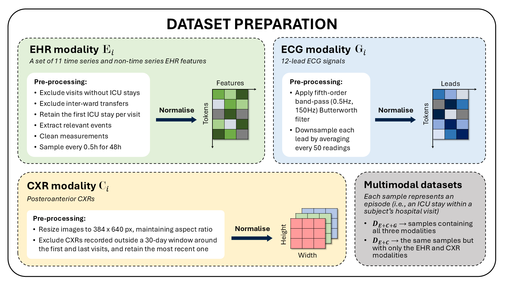
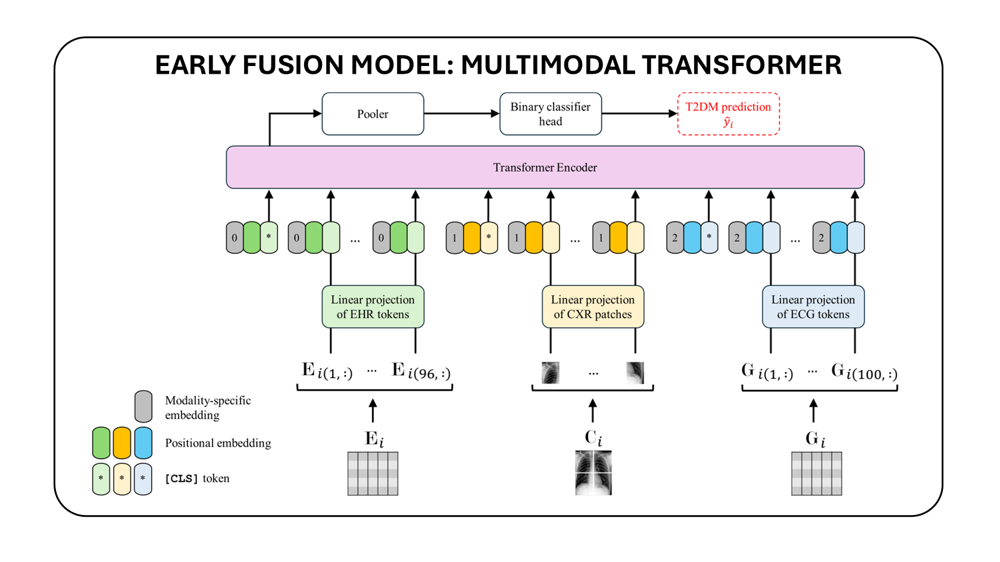
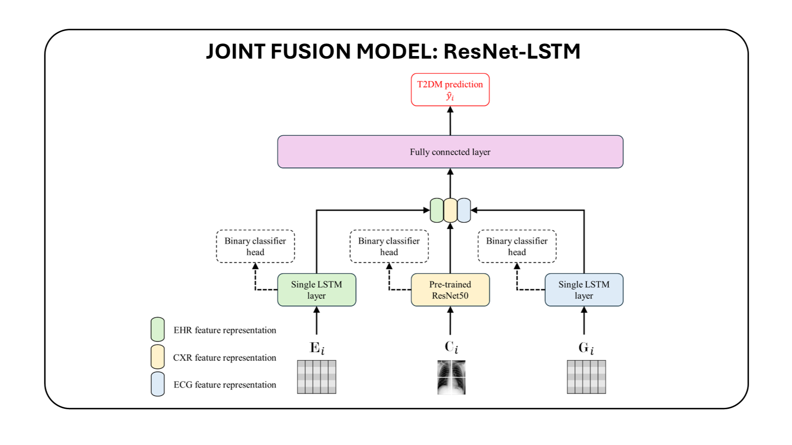

# Deep Learning-Based Noninvasive Screening of Type 2 Diabetes with Chest X-ray Images and Electronic Health Records

# Table of contents
<!--ts-->
  * [Background](#background)
  * [Environment setup](#environment-setup)
  * [Dataset preprocessing pipeline](#dataset-preprocessing-pipeline)
  * [Model training](#model-training)
  * [Model evaluation](#model-evaluation)
  * [Citation](#citation)
  * [Acknowledgements](#acknowledgements)
<!--te-->

# Background
The imperative for early detection of type 2 diabetes mellitus (T2DM) is challenged by its asymptomatic onset and dependence on suboptimal clinical diagnostic tests, contributing to its widespread global prevalence. While research into noninvasive T2DM screening tools has advanced, conventional machine learning approaches remain limited to unimodal inputs due to extensive feature engineering requirements. In contrast, deep learning models can leverage multimodal data for a more holistic understanding of patients’ health conditions. However, the potential of chest X-ray (CXR) imaging, one of the most commonly performed medical procedures, remains underexplored. This study evaluates the integration of CXR images with other noninvasive data sources, including electronic health records (EHRs) and electrocardiography signals, for T2DM detection. Utilising datasets meticulously compiled from the MIMIC-IV databases, we investigated two deep fusion paradigms: an early fusion-based multimodal transformer and a modular joint fusion ResNet-LSTM architecture. The end-to-end trained ResNet-LSTM model achieved an AUROC of 0.86, surpassing the CXR-only baseline by 2.3% with just 9863 training samples. These findings demonstrate the diagnostic value of CXRs within multimodal frameworks for identifying at-risk individuals early. Additionally, the release of the dataset preprocessing pipeline enables and supports further research in this domain.

# Environment setup
1. Clone the repo and navigate to the directory.
    ```
    git clone https://github.com/san-635/t2dm-cxr-ehr.git
    cd t2dm-cxr-ehr
    ```
2. Set up the virtual environment for the preprocessing pipeline scripts:
    ```
    conda env create -f pipeline/environment.yml
    conda activate t2dm-cxr-ehr-p
    ```
3. Set up the virtual environment for the models scripts:
    ```
    conda env create -f models/environment.yml
    conda activate t2dm-cxr-ehr-m
    ```

# Dataset preprocessing pipeline
We use three datasets from the PhysioNet platform: [MIMIC-IV version 2.2](https://doi.org/10.13026/6mm1-ek67), [MIMIC-CXR-JPG version 2.0.0](https://doi.org/10.13026/8360-t248), and [MIMIC-IV-ECG version 1.0](https://doi.org/10.13026/4nqg-sb35). Please acquire these yourself, following the processes outlined on the platform.
<div align="center">
  
</div>

1. Navigate to the `pipeline` directory from the repo:
    ```
    cd pipeline
    ```
2. Run `1_extract_subjects.py`:
    ```
    python 1_extract_subjects.py [MIMIC-IV PATH]
    ```
3. Run the scripts up to `5_resize_cxr.py` in the order denoted by their names.
4. Run `5_resize_cxr.py` and `6_preprocess_and_link_cxr.py`:
    ```
    python 5_resize_cxr.py [MIMIC-CXR-JPG PATH]
    python 6_preprocess_and_link_cxr.py [MIMIC-CXR-JPG PATH]
    ```
5. For obtaining the dataset used in this study:</br>
    a. Run the scripts from `7_extract_ecg.py` to `9_partition_samples.py` in the order denoted by their names.</br>
    b. Finally, run `10_create_D_E+C+G.py` to create the `D_E+C+G` directory within the repo, which will contain the dataset:
    ```
    python 10_create_D_E+C+G.py
    ```
6. For a `D_E+C` dataset completely independent of ECG data:</br>
    a. Skip to and run `9_partition_samples.py` with the `--EHR_CXR_only` flag:
    ```
    python 9_partition_samples.py --EHR_CXR_only
    ```
    b. Finally, run `11_create_D_E+C.py` to create the `D_E+C` directory at the specified path, which will contain the dataset:
    ```
    python 11_create_D_E+C.py [D_E+C PATH]
    ```

# Model training
Navigate to the `models` directory from the repo:
```
cd models
```
## Early fusion model: multimodal transformer
<div align="center">
  
</div>

1. Generate pickle files that facilitate standardisation of EHR and ECG data using train set samples:
    ```
    python ./vilt/ehr_ecg_utils/normalizer_states.py with task_finetune_ehr_ecg_cxr
    ```
2. Download the [pre-trained weights](https://github.com/dandelin/ViLT/releases/download/200k/vilt_200k_mlm_itm.ckpt) of ViLT and move it to the `models/vilt` directory.
3. Finetune the model on all three modalities or without the ECG modality. This will store the best model checkpoints as .ckpt files under the `./results/vilt/D_E+C+G` and `./results/vilt/D_E+C` directories, respectively:
    ```
    python run_vilt.py with task_finetune_ehr_ecg_cxr \
                            modalities="EHR+ECG+CXR" \
                            log_dir = "./results/vilt/D_E+C+G" \
                            gpu_device=[GPU ID] \
                            batch_size = 256 \
                            per_gpu_batchsize = 256
    python run_vilt.py with task_finetune_ehr_ecg_cxr \
                            modalities="EHR+CXR" \
                            log_dir = "./results/vilt/D_E+C" \
                            gpu_device=[GPU ID] \
                            batch_size = 256 \
                            per_gpu_batchsize = 256
    ```
4. Use `tensorboard` visualisations to monitor training:
    ```
    python -m tensorboard.main --logdir ./results/vilt/D_E+C+G
    python -m tensorboard.main --logdir ./results/vilt/D_E+C
    ```

## Joint fusion model: ResNet-LSTM
<div align="center">
  
</div>
### Early training strategy
First, pretrain the modality-specific encoders. This will create the `./results/fusions/{ehr/cxr/ecg}_encoder` directories containing the best checkpoints:
```
sh ./fusions/scripts/pretrain_ehr.sh
sh ./fusions/scripts/pretrain_cxr.sh
sh ./fusions/scripts/pretrain_ecg.sh
```
Then train the remaining model on all three modalities or without the ECG modality. This will store the best model checkpoints as `.pth` files under the `./results/fusions/early/D_E+C+G` and `./results/fusions/early/D_E+C` directories, respectively:
```
sh ./fusions/scripts/early_train_D_E+C+G.sh
sh ./fusions/scripts/early_train_D_E+C.sh
```

### Joint training strategy
Train the model end-to-end on all three modalities or without the ECG modality. This will store the best model checkpoints as `.pth` files under the `./results/fusions/joint/D_E+C+G` and `./results/fusions/joint/D_E+C` directories, respectively:
```
sh ./fusions/scripts/joint_train_D_E+C+G.sh
sh ./fusions/scripts/joint_train_D_E+C.sh
```

# Model evaluation
## Early fusion model: multimodal transformer
```
python run_vilt.py with task_finetune_ehr_ecg_cxr \
                        test_only=True \
                        load_path = [PATH TO RELEVANT .CKPT FILE] \
                        modalities="EHR+ECG+CXR" \
                        log_dir = "./results/vilt/D_E+C+G" \
                        gpu_device=[GPU ID] \
                        batch_size = 256 \
                        per_gpu_batchsize = 256
python run_vilt.py with task_finetune_ehr_ecg_cxr \
                        test_only=True \
                        load_path = [PATH TO RELEVANT .CKPT FILE] \
                        modalities="EHR+CXR" \
                        log_dir = "./results/vilt/D_E+C" \
                        gpu_device=[GPU ID] \
                        batch_size = 256 \
                        per_gpu_batchsize = 256
```

## Joint fusion model: ResNet-LSTM
### Early training strategy
```
sh ./fusions/scripts/early_test_D_E+C+G.sh
sh ./fusions/scripts/early_test_D_E+C.sh
```
### Joint training strategy
```
sh ./fusions/scripts/joint_test_D_E+C+G.sh
sh ./fusions/scripts/joint_test_D_E+C.sh
```

# Citation
If you find this work useful for your research, please cite:
```
@article{gundapaneni2024,
  author = {Gundapaneni, Sanjana and Zhi, Zhou and Rodrigues, Miguel},
  title = {{Deep Learning-Based Noninvasive Screening of Type 2 Diabetes with Chest X-ray Images and Electronic Health Records}},
  journal = {},
  year = {2024},
  doi = {},
  url = {},
}
```
Please be sure to also cite the data sources: [MIMIC-IV](https://doi.org/10.13026/6mm1-ek67), [MIMIC-CXR-JPG](https://doi.org/10.13026/8360-t248), and [MIMIC-IV-ECG](https://doi.org/10.13026/4nqg-sb35).

# Acknowledgements
This work incorporates code from the following sources:
- [ViLT](https://github.com/dandelin/ViLT.git)
- [Multitask learning and benchmarking with clinical time series data](https://github.com/YerevaNN/mimic3-benchmarks.git)
- [MedFuse](https://github.com/nyuad-cai/MedFuse.git)